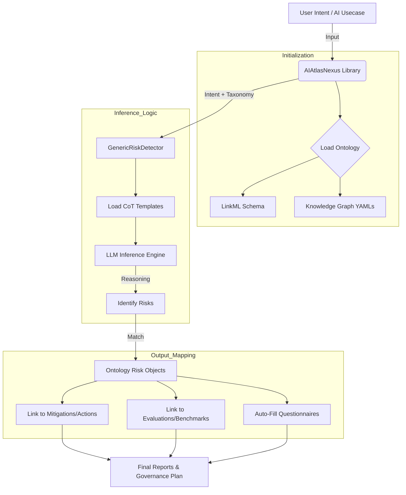

# AI Atlas Nexus: Governance & Risk Assessment Report

## 1. Executive Summary
**AI Atlas Nexus** is an ontology-driven framework designed to automate AI governance. It bridges the gap between high-level ethical principles (like accuracy and fairness) and technical implementation by mapping user "intents" to a curated knowledge graph of risks and mitigations.

---

## 2. Ontology & Data Architecture
The system operates on two distinct layers:

### A. The Schema (The Rules)
*   **Definition**: A LinkML-based structure that defines the relationships (e.g., *Risk* is detected by *RiskControl*).
*   **File Path**: `src/ai_atlas_nexus/ai_risk_ontology/schema/ai-risk-ontology.yaml`
*   **Key Classes**: `Risk`, `Action`, `Taxonomy`, `AiSystem`, `AiEval`.

### B. The Knowledge Graph (The Data)
*   **Definition**: YAML files containing thousands of risks from major frameworks (NIST, MIT, IBM, OWASP).
*   **File Path**: `src/ai_atlas_nexus/data/knowledge_graph/`
*   **Customization**: Users can add their own data by placing a YAML file in this directory or passing a `base_dir` during initialization.

---

## 3. How the Knowledge Graph Works

The AI Atlas Nexus Knowledge Graph (KG) is not just a list of files; it is a **semantically linked network** of governance objects. It uses the LinkML ontology to create relationships between different domains.

### Core Components of the Graph:
1.  **Nodes (Entities)**: Every object in the graph (a Risk, an Action, a Dataset) is a node with a unique `id`.
2.  **Edges (Relationships)**: Concepts are linked using specific predicates:
    *   `isPartOf`: Links a Risk to a broader Risk Group.
    *   `hasRelatedAction`: Links a Risk to a possible Mitigation/Action.
    *   `isDetectedBy`: Links a Risk to a technical Risk Control.
    *   `isDefinedByTaxonomy`: Links an object to its source framework (e.g., NIST).

### How it is Used:
*   **Unified Querying**: The `AtlasExplorer` class allows you to jump from a detected risk (e.g., "Data Bias") to all related mitigations across different frameworks simultaneously.
*   **Lifting and Mapping**: The graph stores "mappings" (like exact matches or broad matches) between different taxonomies. This allows the system to say: *"If NIST mentions this risk, then the IBM Risk Atlas also covers it here."*
*   **In-Memory Graph**: Upon initialization, all YAML files are loaded into an in-memory `Container` object, which acts as a searchable graph database within your Python session.

---

## 4. Visual Flow Diagram



---

## 4. High-Level Process Flow
The transformation of a raw "Intent" into an actionable governance plan follows this four-step sequence:

| Step | Action | Logic | Function Reference |
| :--- | :--- | :--- | :--- |
| **1** | **Intent Input** | User provides a natural language description. | `usecase = "..."` |
| **2** | **Risk Detection** | LLM identifies ontology risks matching the intent. | `identify_risks_from_usecases()` |
| **3** | **Mitigation Mapping**| System retrieves linked actions from the ontology. | `get_related_actions(risk=...)` |
| **4** | **Gov Assessment** | Chain-of-Thought completes policy questionnaires. | `generate_few_shot_questionnaire()` |

---

## 4. Technical Execution Guide

### How to Add Your Intent
Your "intent" is defined as a string and passed to the detection engine.
```python
# Technical Entry Point
usecase = "An AI system used to shortlist job candidates from CV data."
risks = ran.identify_risks_from_usecases(usecases=[usecase], taxonomy="ibm-risk-atlas")
```

### How to Add Custom Ontology Data

You can add your own risks, actions, and taxonomies without modifying the core library code. AI Atlas Nexus supports a "merge-on-load" strategy.

#### 1. Prepare a YAML File
Create a YAML file (e.g., `custom_risks.yaml`). It must follow the **`Container`** structure defined in the ontology.

```yaml
# Example: custom_risks.yaml
risks:
  - id: my-org-bias-01
    name: "Departmental Recruitment Bias"
    description: "Risk of biased shortlisting in the HR department's specific tools."
    taxonomy: "my-internal-gov"
    tag: "hr-bias"
    hasRelatedAction:
      - "nist-perform-bias-testing" # You can link to existing NIST actions

actions:
  - id: audit-hr-ai
    name: "Quarterly HR AI Audit"
    description: "Manual review of top 100 automated shortlists."
    hasRelatedRisk:
      - "my-org-bias-01"

taxonomies:
  - id: my-internal-gov
    name: "Internal Organization Governance"
    description: "Custom governance framework for our specific industry."
```

#### 2. Organize your Data Folder
Place all your custom YAML files in a single folder. The library will search this folder recursively.
```text
/my_governance_project/
└── custom_ontology/
    ├── hr_risks.yaml
    └── finance_risks.yaml
```

#### 3. Initialize with `base_dir`
When creating the `AIAtlasNexus` instance, point it to your folder. It will load the built-in data **plus** your custom data.

```python
from ai_atlas_nexus.library import AIAtlasNexus

# Path to your custom data folder
custom_path = "./my_governance_project/custom_ontology/"

# Initialize the library
ran = AIAtlasNexus(base_dir=custom_path)

# Verification: Check if your custom taxonomy exists
my_risks = ran.get_all_risks(taxonomy="my-internal-gov")
print(f"Loaded {len(my_risks)} custom risks.")
```

#### 4. Advanced: Overriding/Merging
*   **Merging**: If you use an ID that already exists in the standard library (e.g., `atlas-data-bias`), the system will merge your custom fields into the existing object.
*   **Validation**: Ensure your YAML keys match the LinkML schema (`src/ai_atlas_nexus/ai_risk_ontology/schema/`).

---

## 5. Sample Output: Risk Identification Report
*Based on Intent: "Predictive tool for student performance in high schools."*

| Risk ID | Risk Name | Description | Related Action |
| :--- | :--- | :--- | :--- |
| `atlas-data-bias` | Data Bias | Skewed results based on socio-economic data. | "Perform bias testing on datasets." |
| `atlas-privacy` | Privacy Breach | Exposure of sensitive minor data. | "Implement differential privacy." |
| `nist-transparency` | Lack of Transparency | Parents/Students unaware of variable weights. | "Publish AI FactSheet/Model Card." |

---

## 6. Recommendations
1.  **Utilize Taxonomies**: Switch between `nist-ai-rmf` and `ibm-risk-atlas` to get different perspectives on the same intent.
2.  **Custom Mitigation**: Map your organization's specific internal security controls to the ontology's `Action` class for a customized compliance report.
3.  **Few-Shot Tuning**: Use the `cot_examples` parameter in the identification function to improve accuracy for niche industries.
